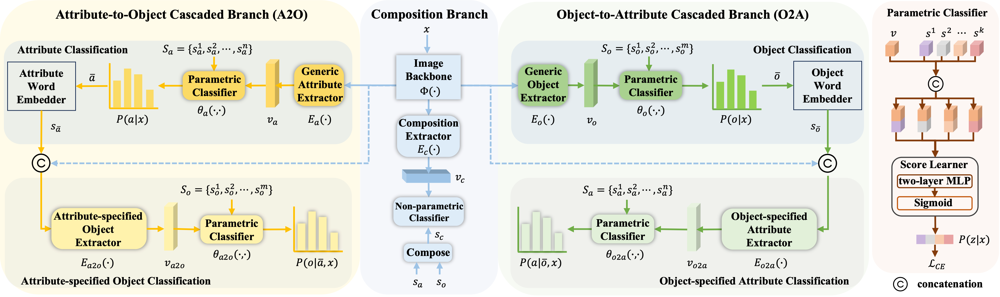

# CSCNET: Class-Specified Cascaded Network for Compositional Zero-Shot Learning (ICASSP 2024)
PyTorch code for the ICASSP 2024 paper:\
**CSCNET: Class-Specified Cascaded Network for Compositional Zero-Shot Learning**\
*Yanyi Zhang, Qi Jia, Xin Fan, Yu Liu, Ran He*\
IEEE Conference on Acoustics, Speech and Signal Processing (ICASSP), 2024 \
[[arXiv]]

## Abstract
Attribute and object (A-O) disentanglement is a fundamental and critical problem for Compositional Zero-shot Learning (CZSL), whose aim is to recognize novel A-O compositions based on foregone knowledge. Existing methods based on disentangled representation learning lose sight of the contextual dependency between the A-O primitive pairs. Inspired by this, we propose a novel A-O disentangled framework for CZSL, namely Class-specified Cascaded Network (CSCNet). The key insight is to firstly classify one primitive and then specifies the predicted class as a priori for guiding another primitive recognition in a cascaded fashion. To this end, CSCNet constructs Attribute-to-Object and Object-to-Attribute cascaded branches, in addition to a composition branch modeling the two primitives as a whole. Notably, we devise a parametric classifier (ParamCls) to improve the matching between visual and semantic embeddings. By improving the A-O disentanglement, our framework achieves superior results than previous competitive methods.

## Citation
**If you found our work useful for your research, please cite our work**:
    
    @INPROCEEDINGS{Yanyi_2024_ICASSP,
      author={Zhang, Yanyi and Jia, Qi and Fan, Xin and Liu, Yu and He, Ran},
      booktitle={Proceedings of the IEEE International Conference on Acoustics, Speech and Signal Processing}, 
      title={CSCNet: Class-Specified Cascaded Network for Compositional Zero-Shot Learning}, 
      year={2024},
      pages={3705-3709}
      }

Feel free to contact us: yanyi.zhang{at}mail.dlut.edu.cn

## Support Ukraine 🇺🇦 and Free Palestine 🇵🇸
I oppose any form of military invasion and massacre and strongly condemn the heinous actions of Russia and Israel.  The world needs peace.

[arXiv]: https://arxiv.org/abs/2403.05924
